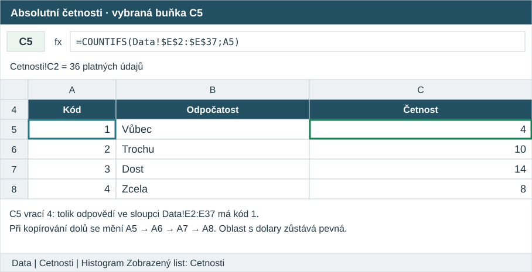
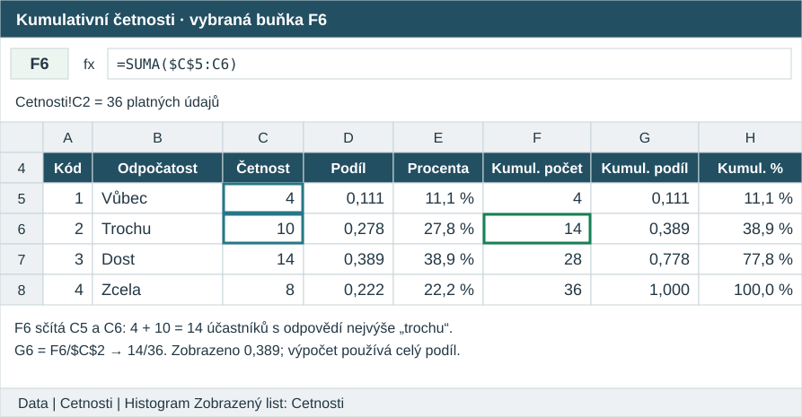
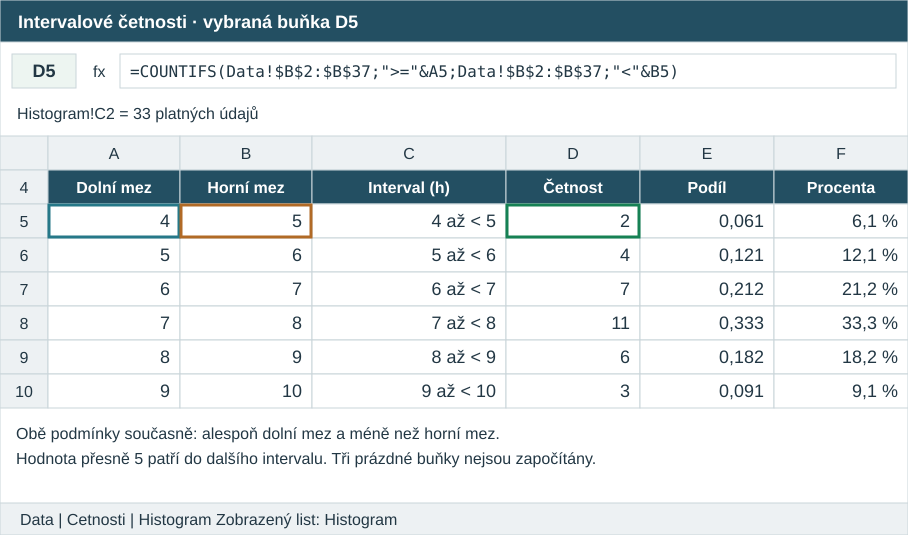

# Četnosti, rozdělení dat a jejich zobrazení {#sec-kapitola-02}

Máme tabulku odpovědí a výsledků paměťové úlohy. Kolik účastníků se cítilo dost odpočatě? Kolik si vybavilo nejvýše šest slov? Jaké doby spánku byly obvyklé a objevily se také nezvykle krátké nebo dlouhé? V datové matici můžeme hledat jednotlivé lidi; k odpovědím na tyto otázky však potřebujeme údaje uspořádat a shrnout.

Navážeme na [modelovou studii spánku a vybavování slov](kapitola_01.qmd#sec-datova-matice). Všechny číselné příklady a grafy v této kapitole vycházejí z **modelových dat záměrně sestavených pro výuku**. Nejde o výsledky skutečného výzkumu ani o doklad vztahu mezi spánkem a pamětí. Postupy mají obecné použití; interpretace se vždy vztahuje k popisovanému souboru.

::: {.callout-note title="Co budete po prostudování umět"}
Sestavíte četnostní tabulku a vysvětlíte rozdíl mezi počtem případů, jejich podílem a kumulativní četností. Určíte, z jakého celku se procenta počítají. Přečtete jednoduchý zápis sumace, rozdělíte číselné hodnoty do jednoznačných intervalů a zvolíte vhodný graf. Popíšete základní rysy rozdělení a rozpoznáte zavádějící zobrazení. V Excelu zopakujete výpočet četností a vytvoříte sloupcový graf a histogram.
:::

## Od jednotlivých záznamů k četnostem {#sec-od-zaznamu-k-cetnostem}

V úvodním příkladu přišel každý účastník jednou. Jeden řádek tedy představuje jednoho člověka při jedné návštěvě. Před paměťovou úlohou odpovídal na otázku „Jak odpočatě se právě cítíte?“ Možnosti byly 1 = vůbec, 2 = trochu, 3 = dost a 4 = zcela. Připomeňme prvních šest záznamů:

::: table-scroll
| Účastník | Spánek (h) | Vybavená slova | Odpočatost |
|---|---:|---:|---|
| P01 | 6 | 5 | trochu |
| P02 | 8 | 9 | zcela |
| P03 | 7 | 8 | dost |
| P04 | 5 | 6 | trochu |
| P05 | neuvedeno | 7 | dost |
| P06 | 7 | 0 | vůbec |
:::

Odpověď „trochu“ najdeme dvakrát, odpověď „dost“ také dvakrát. **Absolutní četnost (*absolute frequency*)** je počet případů s určitou kategorií, hodnotou nebo hodnotou v určitém intervalu. Je to nezáporné celé číslo: například dva účastníci, nikoli „dva body odpočatosti“.

**Četnostní tabulka (*frequency table*)** přiřadí každé kategorii nebo hodnotě její četnost. V tomto příkladu stačí čtyři řádky:

| Odpočatost | Absolutní četnost |
|---|---:|
| Vůbec | 1 |
| Trochu | 2 |
| Dost | 2 |
| Zcela | 1 |
| **Celkem** | **6** |

Takto vidíme **rozdělení četností (*frequency distribution*)**: jak se případy rozdělují mezi jednotlivé kategorie či hodnoty. Tabulka a graf jsou dva způsoby jeho zobrazení. Rozdělení samo není totožné s konkrétním obrázkem [@howell, oddíl 2.1; @privitera, oddíly 2.1–2.3].

Shrnutí něco zachová a něco ztratí. Z tabulky poznáme, že dva lidé odpověděli „dost“, ale už nepoznáme, kteří lidé to byli ani kolik slov si vybavili. Původní matici proto uchováváme. Četnosti lze sestavit pro nominální kategorie, uspořádané odpovědi i číselné hodnoty; nejsou vyhrazeny jednomu typu proměnné.

### Co vlastně počítáme {#sec-co-pocitame}

**Rozsah souboru (*sample size*)**, označený kurzivním $n$, zde znamená počet zahrnutých případů. Pro šest odpovědí na odpočatost je $n=6$. Při opakovaném měření bychom ale mohli počítat návštěvy nebo jednotlivé pokusy. Sto odpovědí jednoho člověka není sto účastníků. U každé tabulky proto uvedeme, co jeden započítaný případ představuje.

Četnost 0 znamená, že se daná kategorie mezi zahrnutými případy nevyskytla. Není totéž co chybějící údaj. U P06 je nula skutečným počtem vybavených slov; u P05 dobu spánku neznáme. V tabulce možných odpovědí má smysl uvést také přípustnou kategorii s nulovou četností, aby byla viditelná celá stupnice [@aron, s. 7–8].

## Podíly, procenta a jejich základ {#sec-relativni-cetnost}

Ve skupině 20 studentů uvedlo potíže se soustředěním 8 lidí, ve skupině 50 studentů 15 lidí. Druhá skupina obsahuje více takových odpovědí, ale je také větší. Chceme-li porovnat jejich zastoupení, potřebujeme vztáhnout počet odpovědí k počtu lidí v příslušné skupině: $8/20=0{,}400$, zatímco $15/50=0{,}300$. V prvním souboru jde o 40,0 %, ve druhém o 30,0 %.

**Relativní četnost (*relative frequency*)** je podíl případů s danou hodnotou nebo kategorií na všech případech zahrnutých do výpočtu. Zlomek $8/20$ zde říká „osm z dvaceti“; výsledek 0,4 znamená čtyři desetiny celku. Relativní četnost nabývá hodnot od 0 do 1 včetně. Nula znamená žádný zahrnutý případ, jednička všechny.

Pro jednotlivé řádky použijeme **index (*index*)** $i$: malé číslo napsané dole, které říká, o kterou kategorii jde. V tabulce odpočatosti značí $i=1$ odpověď „vůbec“, $i=2$ odpověď „trochu“ a tak dále. **Index zde označuje kategorii, nikoli účastníka.** Absolutní četnost označíme $f_i$ a relativní četnost $p_i$:

$$
p_i=\frac{f_i}{n}.
$$

Čitatel $f_i$ je počet případů v kategorii, jmenovatel $n$ počet všech zahrnutých případů. Dělením zjišťujeme, jak velkou část celku daná kategorie tvoří. Pro odpověď „trochu“ v malé tabulce je $f_2=2$, $n=6$, tedy $p_2=2/6=0{,}333\ldots$. Tři tečky znamenají, že desetinný rozvoj pokračuje. Zde se trojka opakuje bez konce.

**Procento (*percent*)** je jedna setina celku. Podíl převedeme na procentní vyjádření tak, že jej vynásobíme stem a připojíme znak %. Z podílu $2/6$ tak dostaneme přibližně 33,3 %. Procentní vyjádření není další nezávislý druh četnosti: podíl 0,25 a 25 % vyjadřují stejnou část celku.

### Proč vždy potřebujeme vědět „z čeho“ {#sec-jmenovatel}

U spánku máme v malé matici šest účastníků, ale jen pět známých odpovědí. Tři známé údaje dosahují alespoň sedmi hodin (P02, P03 a P06). Můžeme proto říci:

- Ze **všech šesti účastníků** máme u tří zaznamenán spánek alespoň sedm hodin: $3/6=0{,}500$, tedy 50,0 %.
- Z **pěti účastníků se známou dobou spánku** splňují tuto podmínku tři: $3/5=0{,}600$, tedy 60,0 %.

Oba výpočty jsou správné, ale odpovídají na různé otázky. Nevíme, zda podmínku splňuje i P05. První výrok proto není totéž jako tvrzení, že přesně polovina všech účastníků skutečně spala alespoň sedm hodin. U tabulky výslovně uvedeme počet platných údajů a počet chybějících. Chybějící hodnoty nenahrazujeme nulami a neodstraňujeme potichu.

Podobně musíme rozlišit procento lidí a procento odpovědí, když lze zvolit více možností. Jestliže jeden člověk označí dvě strategie učení, může být započítán u obou. Podíly lidí volících jednotlivé strategie pak nemusí dát dohromady 100 %. Pro běžnou tabulku rozdělení jedné proměnné budeme pracovat s kategoriemi, do nichž patří každý zahrnutý případ právě jednou.

### Zaokrouhlení mění zápis, ne výpočet {#sec-zaokrouhlovani-02}

V této učebnici budeme podíly zpravidla zobrazovat na **tři desetinná místa**, procenta na **jedno desetinné místo**. Počty případů zůstávají celá čísla. Hodnota 0,400 je tedy tentýž podíl jako 0,4; nuly sjednocují přesnost zobrazení v tabulce.

Mezivýpočty nezaokrouhlujeme. Procenta i pozdější součty počítáme z původních četností nebo z nezkrácených podílů. Například tři kategorie po jednom případu mají každá přesný podíl $1/3$. Zobrazené hodnoty 0,333 dají součet 0,999 a zobrazených 33,3 % třikrát dá 99,9 %. Ve skutečnosti pokrývají celý soubor. Chybějící desetinu procenta proto svévolně nepřičítáme jedné kategorii; případný rozdíl vysvětlíme zaokrouhlením.

## Součty četností a znak sumace {#sec-sumace}

V malé tabulce odpočatosti můžeme zkontrolovat, zda jsme každý případ započítali právě jednou:

$$
n=f_1+f_2+f_3+f_4=1+2+2+1=6.
$$

Pro delší tabulku by vypisování všech členů bylo nepohodlné. **Sumace (*summation*)** je sčítání zapsané pomocí znaku $\sum$, velkého řeckého písmene sigma. Znak je operátor: pokyn něco sečíst. Neoznačuje populační parametr.

$$
\sum_{i=1}^{4} f_i=f_1+f_2+f_3+f_4.
$$

Čteme „součet četností $f_i$ pro $i$ od jedné do čtyř“. Zápis $i=1$ pod znakem určuje, kde začneme, číslo 4 nahoře, kde skončíme. Postupně dosadíme za $i$ hodnoty 1, 2, 3 a 4 a vzniklé členy sečteme. Čísla pod a nad znakem se mezi sebou nenásobí; určují rozsah sčítání.

Počet kategorií označíme $k$. Rozlišujeme tedy $n$, počet případů, a $k$, počet kategorií. V malé tabulce je $n=6$, ale $k=4$. Obecná kontrola úplné četnostní tabulky má podobu:

$$
\sum_{i=1}^{k} f_i=n,\qquad \sum_{i=1}^{k} p_i=1.
$$

První vztah říká, že sečtením počtů ve všech kategoriích dostaneme počet zahrnutých případů. Druhý říká, že sečtením jejich podílů dostaneme celý soubor. **Podmínkou je úplné rozdělení případů do navzájem se nepřekrývajících kategorií, se stejným jmenovatelem pro všechny podíly.** Vztah pro relativní četnosti se týká nezaokrouhlených hodnot. S kategoriemi vícečetných odpovědí by automaticky neplatil.

Přehled symbolů najdete v [tabulce značení](znaceni.qmd#znak-sumace). Znak sumace budeme používat tam, kde zkrátí a zpřehlední skutečný součet, nikoli jako náhradu za vysvětlení jeho významu.

## Kumulativní četnosti: kolik případů je až po danou hodnotu {#sec-kumulativni-cetnosti}

Otázka „Kolik lidí odpovědělo trochu?“ se týká jedné kategorie. Otázka „Kolik lidí odpovědělo nejvýše trochu?“ zahrnuje odpovědi „vůbec“ i „trochu“. V malé tabulce je to $1+2=3$ lidí, tedy polovina souboru.

**Kumulativní četnost (*cumulative frequency*)** postupně sčítá četnosti od nejnižší hodnoty či kategorie až po zvolenou hranici. Budeme ji počítat vzestupně a včetně příslušné kategorie. Kumulativní absolutní četnost označíme $f_{\mathrm{kum},i}$, kumulativní relativní četnost $p_{\mathrm{kum},i}$. Část „kum“ v indexu pouze připomíná kumulování:

$$
f_{\mathrm{kum},i}=f_1+\cdots+f_i,\qquad
p_{\mathrm{kum},i}=\frac{f_{\mathrm{kum},i}}{n}.
$$

Tři tečky mezi členy znamenají, že pokračujeme stejným způsobem přes všechny mezilehlé kategorie. Pro třetí kategorii například dosadíme $f_{\mathrm{kum},3}=1+2+2=5$ a $p_{\mathrm{kum},3}=5/6$, tedy přibližně 0,833 neboli 83,3 %.

::: table-scroll
| Odpočatost | $f_i$ | $p_i$ | Procenta | $f_{\mathrm{kum},i}$ | Kumulativní procenta |
|---|---:|---:|---:|---:|---:|
| Vůbec | 1 | 0,167 | 16,7 % | 1 | 16,7 % |
| Trochu | 2 | 0,333 | 33,3 % | 3 | 50,0 % |
| Dost | 2 | 0,333 | 33,3 % | 5 | 83,3 % |
| Zcela | 1 | 0,167 | 16,7 % | 6 | 100,0 % |
:::

Každý kumulativní sloupec musí být neklesající: další četnost je nezáporná. Poslední kumulativní počet je $n$, poslední kumulativní podíl 1. **Kumulativní sloupec už nesčítáme**, protože tytéž případy obsahuje opakovaně.

U odpočatosti má kumulování význam díky pořadí kategorií. U nominální proměnné, například hlavního způsobu přípravy na zkoušku, není „nejvýše čtení“ přirozenou hranicí. Součet podle nahodilého pořadí řádků proto nemá stejný věcný význam. Kumulativní četnosti nevyžadují stejné vzdálenosti mezi kategoriemi; postačuje smysluplné pořadí.

::: worked-example
**Méně než, nejvýše a alespoň.** Počty vybavených slov v malé matici jsou 5, 9, 8, 6, 7 a 0. Méně než 7 slov si vybavili tři lidé (0, 5, 6), nejvýše 7 slov čtyři lidé (0, 5, 6, 7). Alespoň 7 slov si vybavili tři lidé (7, 8, 9). Pro poslední počet můžeme od všech šesti odečíst tři s výsledkem **menším než 7**. Kdybychom odečetli počet s výsledkem nejvýše 7, nesprávně bychom vyřadili i člověka se sedmi slovy.
:::

## Větší soubor a tabulky jednotlivých hodnot {#sec-modelova-data-02}

Nyní použijeme pevně sestavený soubor **36 modelových účastníků**. Prvních šest záznamů je shodných s původní maticí, dalších třicet slouží k názornějšímu zobrazení četností. Každý účastník absolvoval stejnou úlohu s dvanácti slovy jednou, v tichu. Odpočatost je zaznamenána u všech; dobu spánku neuvedli P05, P11 a P24.

Úplná data i výpočty jsou v [excelovém sešitu ke kapitole](../data/kapitola_02.xlsx). List `Data` obsahuje původní hodnoty, list `Cetnosti` shrnutí odpočatosti a list `Histogram` intervalové třídění spánku. Chybějící spánek zůstává prázdnou buňkou. Definice proměnných navazují na [přehled v předchozí kapitole](kapitola_01.qmd#sec-codebook); identifikátory zde pokračují až po P36.

::: table-scroll
| Odpočatost | $f_i$ | $p_i$ | Procenta | $f_{\mathrm{kum},i}$ | $p_{\mathrm{kum},i}$ |
|---|---:|---:|---:|---:|---:|
| Vůbec | 4 | 0,111 | 11,1 % | 4 | 0,111 |
| Trochu | 10 | 0,278 | 27,8 % | 14 | 0,389 |
| Dost | 14 | 0,389 | 38,9 % | 28 | 0,778 |
| Zcela | 8 | 0,222 | 22,2 % | 36 | 1,000 |
:::

Nejčastější odpovědí je „dost“, ale nevybrala ji většina účastníků: 14 z 36 je méně než polovina. Nejvýše „trochu“ odpovědělo také 14 lidí. Stejný počet zde vznikl pro dvě různé otázky; samotné číslo bez popisu nestačí.

Počet slov můžeme zatím shrnout bez seskupování: možné hodnoty jsou celá čísla od 0 do 12.

::: table-scroll
| Počet slov | 0 | 1 | 2 | 3 | 4 | 5 | 6 | 7 | 8 | 9 | 10 | 11 | 12 |
|---|---:|---:|---:|---:|---:|---:|---:|---:|---:|---:|---:|---:|---:|
| Počet účastníků | 1 | 0 | 1 | 1 | 2 | 4 | 5 | 6 | 6 | 4 | 3 | 2 | 1 |
:::

Oba sousední výsledky 7 a 8 slov mají po šesti případech. Nulová četnost u jednoho slova zachovává informaci, že jde o možný, ale v tomto souboru nezaznamenaný výsledek.

## Intervalové třídění číselných údajů {#sec-tridni-intervaly}

U doby spánku máme mnoho různých desetinných hodnot. Dlouhá tabulka jednotlivých časů by znesnadňovala přehled. **Intervalové třídění (*grouping into class intervals*)** proto spojuje sousední číselné hodnoty do skupin. **Třídní interval (*class interval, bin*)** je vymezen dolní a horní hranicí; jeho šířka je rozdíl těchto hranic [@howell, oddíl 2.2; @dostal, oddíl 3.2.1].

V našem příkladu zvolíme šířku jedné hodiny. Interval od 6 hodin včetně do 7 hodin bez sedmičky obsahuje například 6,0, 6,2 a 6,8, ale už ne 7,0. Hodnota 7,0 patří do následujícího intervalu. Tento vztah můžeme zapsat také slovy „alespoň 6 a méně než 7 hodin“.

::: table-scroll
| Spánek (hodiny) | Dolní hranice patří dovnitř | Horní hranice už nepatří | Četnost | Podíl z 33 platných údajů |
|---|---:|---:|---:|---:|
| 4 až méně než 5 | 4 | 5 | 2 | 0,061 |
| 5 až méně než 6 | 5 | 6 | 4 | 0,121 |
| 6 až méně než 7 | 6 | 7 | 7 | 0,212 |
| 7 až méně než 8 | 7 | 8 | 11 | 0,333 |
| 8 až méně než 9 | 8 | 9 | 6 | 0,182 |
| 9 až méně než 10 | 9 | 10 | 3 | 0,091 |
| **Celkem** | | | **33** | **1,000** |
:::

Nejvíce známých údajů leží mezi 7 hodinami včetně a 8 hodinami bez horní hranice: 11 z 33, tedy 33,3 %. Tabulka popisuje pouze platné údaje; tři chybějící nejsou skrytě přiřazeny k nejkratšímu spánku.

Hranice volíme tak, aby pokryly všechny zahrnuté hodnoty a žádná nebyla započítána dvakrát. Opačné pravidlo, kdy patří dovnitř horní hranice, je také možné; musíme je však uvést a používat důsledně. Naše nejvyšší hodnota 9,5 je pokryta. Kdyby přibyl údaj 10,0, museli bychom doplnit další interval nebo výslovně změnit pravidlo posledního intervalu.

Seskupením ztrácíme přesnost. Z tabulky zjistíme přesně, že méně než 7 hodin uvedlo $2+4+7=13$ účastníků. Nezjistíme z ní přesně, kolik lidí uvedlo méně než 6,5 hodiny: neznáme jejich rozmístění uvnitř intervalu 6 až méně než 7. Pro přesnou odpověď se vrátíme k jednotlivým záznamům. Ani střed intervalu není skutečnou hodnotou každého člověka v něm.

## Grafy četností {#sec-grafy-cetnosti}

Tabulka pomáhá dohledat čísla, graf usnadňuje vnímání vzorců a rozdílů. Před čtením grafu zjistíme, co představují jeho osy, jaké mají jednotky a co je jedním případem. Výška sloupce může znamenat počet lidí, podíl nebo procento; nelze to určit jen podle vzhledu.

### Sloupcový graf {#sec-sloupcovy-graf}

**Sloupcový graf (*bar chart*)** přiřazuje kategoriím samostatné sloupce, jejichž výšky vyjadřují četnosti. Vodorovná varianta využívá délky pruhů a bývá vhodná pro dlouhé slovní popisky. U ordinálních odpovědí zachováme jejich smysluplné pořadí. U nominálních kategorií můžeme pořadí zvolit podle otázky, například podle četnosti.

{#fig-odpocatost fig-alt="Čtyři oddělené sloupce: vůbec 4, trochu 10, dost 14 a zcela 8 účastníků. Svislá osa začíná nulou."}

@fig-odpocatost ukazuje, že „dost“ se vyskytuje nejčastěji a „vůbec“ nejméně často. Pořadí má význam, ale graf neopravňuje vykládat vzdálenosti mezi kategoriemi jako stejné rozdíly v prožitku. Oddělené sloupce právě pomáhají připomenout, že zobrazujeme kategorie.

Při porovnávání různě velkých skupin může být užitečnější zobrazit relativní četnosti. V takovém případě uvedeme u každé skupiny také počet zahrnutých případů. Podobně vypadající procenta založená na pěti a pěti stech případech nesou odlišnou informaci o množství pozorovaných dat.

### Tečkový graf jednotlivých pozorování {#sec-teckovy-graf}

**Tečkový graf jednotlivých pozorování (*dot plot*)** umístí každé pozorování jako jednu tečku nad jeho číselnou hodnotu. Opakované hodnoty skládáme nad sebe. Svislá poloha tečky zde pouze uvolňuje místo dalším tečkám; nepředstavuje druhou měřenou proměnnou.

{#fig-slova-tecky fig-alt="36 teček nad počty slov 0 až 12. Nejvyšší sloupky mají hodnoty 7 a 8 s šesti tečkami, u hodnoty 1 není žádná tečka."}

V @fig-slova-tecky vidíme největší soustředění okolo 7–8 slov i jediný nulový výsledek. Tečky umožňují zachovat všechny hodnoty a současně ukázat jejich uspořádání. Podobný postup doporučují Cumming a Calin-Jageman [-@cumming, s. 43–47]. U velmi velkého souboru se tečky mohou překrývat nebo zabírat příliš místa; potom pomůže souhrnné zobrazení.

### Histogram {#sec-histogram}

**Histogram (*histogram*)** zobrazuje četnosti číselných hodnot v třídních intervalech. Vodorovná osa je číselná stupnice. Každý obdélník se rozkládá přes skutečnou šířku příslušného intervalu. Při stejně širokých intervalech může jeho výška přímo vyjadřovat počet případů.

{#fig-spanek-hist fig-alt="Šest navazujících intervalů šířky jedné hodiny od 4 do 10. Počty jsou postupně 2, 4, 7, 11, 6 a 3."}

V @fig-spanek-hist navazují intervaly bez mezer. Pokud některý interval nemá žádný případ, zůstane na číselné ose prázdné místo odpovídající jeho šířce; sousední obsazené intervaly nesmíme přisunout k sobě. Rozdíl proti sloupcovému grafu tedy není pouhá přítomnost či nepřítomnost mezery. Rozhodující je, zda osa představuje samostatné kategorie, nebo číselné intervaly.

Histogram není vyhrazen pouze spojitým proměnným. Seskupit do číselných intervalů můžeme také diskrétní hodnoty, například počty chyb při dlouhé úloze. Pro několik málo možných celých hodnot však může být přehlednější ukázat četnosti jednotlivých hodnot nebo tečky.

### Jak intervaly mění obraz dat {#sec-volba-intervalu}

Pro intervaly neexistuje jediná vždy správná šířka. Úzké intervaly zachovají více podrobností, ale mohou zvýraznit nahodilé nepravidelnosti. Široké intervaly obraz zjednoduší, ale mohou skrýt důležité rozdíly. Záleží i na poloze hranic, nejen na jejich vzdálenosti [@howell, s. 20–21; @cumming, s. 46–47].

{#fig-sirka-intervalu fig-alt="Dva histogramy stejného spánku. Levý má dvanáct půlhodinových intervalů, pravý tři dvouhodinové intervaly. Osy mají stejné rozsahy, širší intervaly slučují více hodnot."}

Vyšší sloupce v pravém grafu @fig-sirka-intervalu neznamenají více účastníků; každý sloupec jen zahrnuje širší rozsah časů. Jednohodinová verze ukazuje, že nejčetnější interval je 7 až méně než 8 hodin. Ve dvouhodinové verzi se tato informace ztrácí ve společném intervalu 6 až méně než 8 hodin. V praxi porovnáme několik rozumných nastavení a závěr neopřeme o drobný vrchol, který po malém posunu hranic zmizí.

::: {.callout-note collapse="true" title="Rozšíření: nestejně široké intervaly"}
Pokud mají intervaly různé šířky, stejné výšky obdélníků vytvářejí různé plochy. Aby plocha odpovídala četnosti, vydělíme četnost šířkou intervalu. Například 10 případů v intervalu šířky 1 hodina dá výšku 10 případů na hodinu; 10 případů v intervalu šířky 2 hodiny dá výšku 5 případů na hodinu. Plochy jsou v obou případech stejné: $10\times1=5\times2=10$.

Výška pak vyjadřuje četnost připadající na jednotku šířky intervalu. U relativní varianty vydělíme šířkou intervalu relativní četnost; celková plocha je pak 1. Výška sama už není podíl a může být větší než 1. V základních příkladech této kapitoly používáme stejně široké intervaly a osu s počty. Rozdílná měřítka histogramu popisuje @nistHistogram [oddíl Definition].
:::

### Graf kumulativních četností {#sec-kumulativni-graf}

**Graf kumulativních četností (*cumulative frequency graph*)** ukazuje, kolik případů nebo jaký podíl má hodnotu nejvýše rovnou zvolené hranici. Pro jednotlivé přesně zaznamenané hodnoty má podobu schodů: mezi pozorovanými hodnotami se počet nemění, při zahrnutí další hodnoty vzroste.

{#fig-kumulativni-slova fig-alt="Neklesající schodovitý graf výsledků 36 účastníků. Při hranici 6 slov dosahuje 14 z 36, tedy 38,9 procenta; při 8 slovech 26 z 36, tedy 72,2 procenta; při 12 slovech 100 procent."}

V @fig-kumulativni-slova se ptáme na **nejvýše** daný počet slov. U hranice 6 je zahrnuto $1+0+1+1+2+4+5=14$ lidí, tedy 38,9 %. U hranice 8 je jich 26, tedy 72,2 %. Plný bod ukazuje hodnotu včetně dané hranice; prázdný bod ukazuje úroveň těsně před skokem. U jednoho slova nevzniká skok, protože nikdo takový výsledek nemá.

U seskupených údajů se někdy spojí kumulativní četnosti na hranicích intervalů úsečkami. Pro naše intervaly spánku jsou na horních hranicích přesně známy počty **menší než** daná hranice. Úsečka uvnitř intervalu pouze propojuje známé body: přesný počet pod libovolnou vnitřní hranicí ze seskupené tabulky neznáme. Podoba grafu musí respektovat způsob třídění.

### Polygon četností {#sec-polygon-cetnosti}

**Polygon četností (*frequency polygon*)** spojí body, které zobrazují četnosti jednotlivých hodnot nebo třídních intervalů. U intervalového třídění leží body nad středy intervalů. Střed intervalu 6 až méně než 7 hodin je 6,5 hodiny: polovinu vzdálenosti mezi hranicemi přičteme k dolní hranici.

{#fig-polygon-spanek fig-alt="Spojnice šesti bodů nad středy 4,5 až 9,5 hodiny, s četnostmi 2, 4, 7, 11, 6 a 3."}

@fig-polygon-spanek shrnuje stejné údaje jako histogram. Bod nad 7,5 hodinami zastupuje **všech 11 údajů v intervalu**, nikoli 11 lidí spících přesně 7,5 hodiny. Spojnice nepopisuje průběh spánku v čase. Polygony mohou usnadnit porovnání rozdělení více skupin, pokud používají stejné intervaly a vhodné četnostní měřítko [@privitera, s. 58–59].

### Výsečový graf {#sec-vysecovy-graf}

**Výsečový graf (*pie chart*)**, nazývaný také koláčový graf, rozděluje kruh na části odpovídající podílům. Hodí se pouze tam, kde části tvoří jeden vymezený celek. Při vícečetných odpovědích, jejichž procenta se překrývají, by takové rozdělení celku nedávalo smysl.

V samostatném modelovém příkladu si 36 studentů vybralo **jediný hlavní** způsob přípravy: 14 procvičování otázek, 12 čtení a 10 vysvětlování látky vlastními slovy. Jde o popis jejich volby, nikoli o důkaz účinnosti těchto způsobů.

{#fig-vysece-sloupce fig-alt="Výsečový a sloupcový graf stejných četností: procvičování 14, čtení 12, vysvětlování 10. Podíly jsou 38,9, 33,3 a 27,8 procenta."}

Pro přesné porovnávání kategorií budeme zpravidla preferovat sloupcový graf. Polohy konců sloupců na společné stupnici se porovnávají snáze a přesněji než podobně velké výseče. Experimentální oporu tomuto doporučení poskytují @cleveland1984 [s. 536–541]. Výseče přitom vnímáme podle více vodítek, nejen úhlů, ale také ploch a oblouků. Pro orientační zobrazení několika částí celku může být výsečový graf srozumitelný; jeho nevýhody rostou při mnoha nebo podobně velkých částech. Prostorové efekty čitelnost dále zhoršují.

### Graf stonek a list {#sec-stonek-list}

**Graf stonek a list (*stem-and-leaf plot, stem-and-leaf display*)** spojuje přehled o rozdělení s výpisem jednotlivých hodnot. Číslo rozdělí na počáteční část, stonek, a zbývající část, list. Na malém příkladu časů dokončení úlohy v sekundách 12, 14, 14, 18, 21, 23, 27 a 31 dostaneme:

```text
Stonek | Listy
   1   | 2 4 4 8
   2   | 1 3 7
   3   | 1

Klíč: 1 | 2 znamená 12 sekund.
```

Každý list je jeden výsledek; dvě čtyřky v prvním řádku znamenají dva výskyty 14 sekund. Z klíče poznáme jednotku i způsob skládání čísla. Listy uvnitř řádku řadíme vzestupně. Stejný princip můžeme využít i pro desetinné hodnoty, pokud klíč jednoznačně vysvětlí jejich čtení [@privitera, s. 60–61].

Z tohoto zápisu lze rekonstruovat všechny zaznamenané hodnoty včetně opakování, pokud při jeho tvorbě nebyly zaokrouhleny či zkráceny. Nezjistíme původní pořadí záznamů ani přiřazení lidem. U velkého souboru nebo mnoha číslic se zápis stává rozměrným a nepřehledným. Je užitečnou alternativou zejména pro malá data a ruční porozumění rozdělení; pro sdílení úplné datové matice máme samostatný datový soubor.

## Co nám říká tvar rozdělení {#sec-tvar-rozdeleni}

U grafu číselných dat se ptáme, kde se hodnoty soustřeďují, jak široce jsou rozloženy a jaký má jejich rozdělení tvar. Nejprve jej popíšeme slovně; souhrnné číselné charakteristiky budeme zavádět později [@howell, oddíl 2.5; @cumming, s. 44–46].

{#fig-tvary-rozdeleni fig-alt="Šest schematických rozdělení: souměrné s jedním vrcholem, zešikmené doprava, zešikmené doleva, se dvěma vrcholy, s podobnými četnostmi a s jedním vzdáleným pozorováním."}

**Souměrné rozdělení (*symmetric distribution*)** má přibližně zrcadlovou podobu kolem svého středu. V reálných malých souborech neočekáváme dokonalou souměrnost. Souměrnost také sama neznamená, že rozdělení odpovídá určitému teoretickému modelu.

**Chvost rozdělení (*tail*)** označuje okrajovou oblast směrem k nízkým nebo vysokým hodnotám, kde se pozorování vyskytují řidčeji. **Šikmost (*skewness*)** zde popisuje nesouměrnost s výrazněji protaženou jednou stranou. Rozdělení **zešikmené doprava (*right-skewed, positively skewed*)** má delší pravý chvost: mnoho nižších či středních hodnot a několik výrazně vyšších. Například dokončení úlohy má určitou nejkratší možnou dobu, ale některým lidem může trvat podstatně déle. U rozdělení **zešikmeného doleva (*left-skewed, negatively skewed*)** směřuje delší chvost k nízkým hodnotám. Směr pojmenováváme podle chvostu, nikoli podle místa nejvyššího vrcholu.

**Jednovrcholové rozdělení (*unimodal distribution*)** má jeden výrazný vrchol; **dvouvrcholové (*bimodal distribution*)** dva. Vrcholy nemusí být stejně vysoké. Dva vrcholy mohou upozornit například na smíšení výsledků dvou skupin, ale samy existenci takových skupin neprokazují. Sousední stejně vysoké sloupce u 7 a 8 slov v našem příkladu netvoří automaticky dvě oddělená seskupení. Počet viditelných vrcholů navíc ovlivňuje intervalové třídění.

**Odlehlé pozorování (*outlier*)** je pozorování nápadně vzdálené od ostatních v daném kontextu. V této kapitole jde o důvod k prozkoumání, nikoli o automatické pravidlo pro vyřazení. Může jít o překlep, neobvyklé podmínky nebo správně zaznamenaný vzácný výsledek. Zkontrolujeme původní záznam a okolnosti měření; údaj neodstraníme jen proto, aby graf vypadal pravidelněji. Výrazy odlehlá hodnota a odlehlý případ se používají jako alternativy. Označení extrémní hodnota či případ je širší: nejvyšší hodnota v každém souboru existuje, ale nemusí být odlehlá.

### Hranice měření: efekt podlahy a stropu {#sec-podlaha-strop}

**Efekt podlahy (*floor effect*)** vzniká, když měřicí nástroj nedokáže dostatečně rozlišit nízké úrovně a výsledky se hromadí u jeho dolní hranice. Příliš obtížný test například dává mnoha lidem nulu, přestože se jejich znalosti liší. **Efekt stropu (*ceiling effect*)** je obdobná situace u horní hranice: příliš snadný test může dát mnoha lidem maximum a nerozlišit jejich výkony.

{#fig-podlaha-strop fig-alt="Vlevo se nejvíce výsledků hromadí u nuly, vpravo u maxima dvanácti správných odpovědí; v obou případech četnosti postupně klesají směrem do stupnice."}

Samotný výskyt maxima nebo minima ještě takový efekt nedokazuje. Potřebujeme znát nástroj a uvažovat, zda omezuje rozlišení právě v našem souboru. Také ne každé zešikmené rozdělení vzniká efektem podlahy či stropu. Pozorovaný tvar je podnětem k otázkám, nikoli hotovým vysvětlením.

## Čtení grafů a zavádějící zobrazení {#sec-zavadejici-grafy}

Před interpretací zkontrolujeme jednotku případu, popisky a měřítka os, velikost souboru, zacházení s chybějícími údaji a způsob seskupení. U sloupců vyjadřuje velikost četnosti jejich délka od základny, proto osu četností začínáme nulou. Uříznutá osa může malý rozdíl opticky zvětšit.

{#fig-zkracena-osa fig-alt="Dva grafy četností 30 a 32. Vlevo osa začíná nulou, vpravo na 27, takže druhý graf opticky zveličuje rozdíl."}

Oba grafy v @fig-zkracena-osa obsahují stejná čísla a rozdíl je stále dva případy. Vpravo však viditelné části sloupců mají délky 3 a 5, takže obraz naznačuje mnohem výraznější nepoměr. Pro porovnání zastoupení bychom navíc potřebovali celkové počty případů v obou souborech.

Při srovnávání několika histogramů zachováme srovnatelné intervaly a měřítka. Nevynecháme prázdný interval ani nepřeházíme pořadí číselných hodnot. Obrázkové symboly zvětšené současně do výšky i šířky mění plochu rychleji než délku a mohou rozdíl nadsazovat. Obdobná rizika popisují Cumming a Calin-Jageman [-@cumming, s. 67].

Graf získaného souboru také automaticky nepopisuje celou populaci. V malém souboru mohou jednotlivá pozorování výrazně měnit tvar. A žádný z uvedených grafů sám nedokládá příčinu rozdílů. Popisujeme, co bylo zaznamenáno, a oddělujeme to od vysvětlení, která by vyžadovala další informace.

## Četnosti a grafy v Excelu {#sec-excel-cetnosti}

Otevřete [sešit ke kapitole](../data/kapitola_02.xlsx). Postup využívá běžné funkce dostupné v Excelu 2016 a novějších verzích, včetně Microsoft 365. Ukázky používají české názvy funkcí, středníky mezi argumenty a desetinnou čárku. V jiném jazykovém nebo místním nastavení se mohou názvy a oddělovače lišit. Vzorce v hotovém sešitu Excel zobrazuje podle svého nastavení.

Na listu `Data` jsou v řádku 1 názvy proměnných a v řádcích 2–37 data. Sloupce jsou A = `id`, B = `spanek_h`, C = `slova`, D = `cast_dne`, E = `odpocatost`. Číselné vstupy zapisujte jako čísla, bez jednotek v buňce. Tři prázdné buňky spánku ponechte prázdné. Samostatný popis proměnných je vpravo od dat.

### Absolutní četnosti a počet platných údajů {#sec-excel-pocet-countifs}

Na listu `Cetnosti` jsou v A5:A8 kódy 1 až 4 a v B5:B8 jejich slovní popisy. Zápis `A5:A8` označuje obdélníkovou oblast od buňky A5 po A8 včetně. Do C2 zapíšeme:

```text
=POČET(Data!E2:E37)
```

**POČET (*COUNT*)** spočítá buňky obsahující čísla. Argument `Data!E2:E37` určuje oblast: vykřičník odděluje název listu od adresy buněk. Výsledek je **36**, počet číselně zaznamenaných odpovědí odpočatosti. Funkce ignoruje prázdné a textové buňky, ale zahrne skutečnou nulu. Sama neověřuje přípustnost kódu: i chybně zadaná pětka by se započítala [@msCount].

Do C5 vložíme:

```text
=COUNTIFS(Data!$E$2:$E$37;A5)
```

**COUNTIFS (anglicky také *COUNTIFS*)** počítá případy splňující zadané podmínky. První argument je oblast odpovědí, druhý požadovaný kód v A5, zde číslo 1. Dostaneme **4**. Vzorec zkopírujeme dolů do C8; pro další kódy dostaneme 10, 14 a 8. Dolarové znaky zajišťují, že při kopírování zůstane oblast `$E$2:$E$37` pevná, zatímco odkaz A5 se změní na A6, A7 a A8. Dolar není součástí statistického značení, ale pravidlem adresování buněk v Excelu [@msCountifs].

{#fig-excel-absolutni fig-alt="Ukázka tabulky v podobě excelového listu s kódy 1 až 4 a výsledky 4, 10, 14, 8. Řádek vzorců ukazuje COUNTIFS odkazující na sloupec odpočatosti a buňku A5."}

Do C10 vložíme `=SUMA(C5:C8)`. **SUMA (*SUM*)** sečte číselné hodnoty v uvedené oblasti a vrátí **36** [@msSum]. Porovnáme ji s C2. Nerovnost by nás upozornila například na nepokrytou kategorii nebo chybný odkaz. Shoda sama nezaručuje, že každý původní záznam je věcně správný.

### Relativní a kumulativní četnosti {#sec-excel-relativni-kumulativni}

V D5 vypočítáme podíl:

```text
=C5/$C$2
```

Čitatel je četnost první kategorie, jmenovatel pevný odkaz na počet platných odpovědí. Výsledek $4/36$ se po nastavení tří desetinných míst zobrazí jako **0,111**. Kopírováním do D8 získáme ostatní podíly. Znak `/` v Excelu znamená dělení. Kdybychom odkaz na C2 nezafixovali, při kopírování by se posouval na C3 a další nesprávné buňky.

Do E5 vložíme `=D5`, zkopírujeme do E8 a nastavíme formát **Procenta s jedním desetinným místem**. Hodnota se zobrazí jako **11,1 %**. Při použití procentního formátu už vzorec nenásobíme stem: formát procentní převod obstará při zobrazení. Jinak bychom dostali chybných 1 111,1 %.

Kumulativní počet v F5 vypočítáme:

```text
=SUMA($C$5:C5)
```

Začátek oblasti je pevný, konec se při kopírování posouvá. V F6 tak vznikne `=SUMA($C$5:C6)`, výsledek 14; v F7 výsledek 28 a v F8 výsledek 36. Do G5 vložíme `=F5/$C$2` a zkopírujeme dolů. V H5 použijeme `=G5` a procentní formát. Pro druhý řádek tak dostaneme **0,389**, respektive **38,9 %** účastníků s odpovědí nejvýše „trochu“.

{#fig-excel-kumulativni fig-alt="Tabulka odpočatosti s četnostmi, podíly a kumulativními počty. Zvýrazněná F6 obsahuje součet C5 až C6 a výsledek 14. Kumulativní podíl je 0,389."}

Počet desetinných míst upravujeme ve **formátu buněk**, například přes Ctrl+1. Nezkracujeme vstupy ani vzorce. Pro kontrolu D10 obsahuje `=SUMA(D5:D8)` a vrací 1,000; E10 zobrazuje stejný výsledek jako 100,0 %. U kumulativních sloupců další součtový řádek nevytváříme.

### Intervalové četnosti a histogram {#sec-excel-histogram}

Na listu `Histogram` je v C2 `=POČET(Data!B2:B37)`, výsledek **33**. V A5:A10 jsou dolní hranice 4 až 9 a v B5:B10 horní hranice 5 až 10. Do D5 vložíme:

```text
=COUNTIFS(Data!$B$2:$B$37;">="&A5;Data!$B$2:$B$37;"<"&B5)
```

Funkce zde používá dvě dvojice oblast–podmínka. Zápis `">="&A5` spojí text „větší nebo rovno“ s dolní hranicí, takže v prvním řádku znamená „alespoň 4“. Zápis `"<"&B5` znamená „méně než 5“. U každého záznamu musí platit obě podmínky současně. Znak `&` v Excelu spojuje části textové podmínky. Uvozovky označují text; nezapisujeme do nich celý vzorec.

Výsledek D5 je **2**. Po zkopírování do D10 dostaneme postupně 2, 4, 7, 11, 6 a 3. Podíl v E5 vypočítáme `=D5/$C$2`, tedy 0,061 po zobrazení na tři místa. Prázdné buňky v tomto konkrétním příkladu nesplňují podmínku alespoň 4 a nejsou započítány. Při jiných podmínkách nelze automaticky předpokládat stejné zacházení s prázdnou buňkou.

{#fig-excel-intervaly fig-alt="List Histogram s dolními a horními hranicemi, četnostmi 2, 4, 7, 11, 6, 3 a vzorcem COUNTIFS pro současné splnění obou mezí."}

Pro sloupcový graf odpočatosti označíme na listu `Cetnosti` B4:C8 a zvolíme **Vložení → Sloupcový graf → Skupinový sloupcový**. Ověříme, že vodorovná osa obsahuje odpovědi, svislá počty a mezi daty není zahrnut součet. Svislou osu nastavíme od nuly, doplníme popis „Počet účastníků“ a vynecháme prostorové efekty.

Pro histogram z již připravené intervalové tabulky označíme na listu `Histogram` C4:D10. Vložíme rovněž skupinový sloupcový graf a v **Formátu datové řady** nastavíme **Šířku mezery na 0 %**. Zůstanou v něm i intervaly s nulovou četností a zachováme číselné pořadí. Tento postup je vhodný, protože všechny naše intervaly mají stejnou šířku; popisky v C5:C10 jednoznačně uvádějí hranice. Osa ukazuje „Doba spánku (h)“ a „Počet účastníků“, počet platných údajů je 33. Oba upravitelné grafy jsou v sešitu vedle tabulek.

Excel obsahuje také samostatný typ grafu **Histogram**, který se vytváří z původních číselných dat, nikoli z již spočítaných četností. Jeho automatické intervaly a pravidla hranic nemusí odpovídat naší tabulce. Pokud jej použijeme, ověříme nastavení i zařazení hraničních hodnot; pouhý podobný vzhled nestačí [@msHistogram].

## Shrnutí {#sec-shrnuti-02}

Absolutní četnost říká kolik, relativní četnost jakou část určeného celku. Kumulativní četnost odpovídá na otázku o všech případech až po zvolenou hranici. Správný jmenovatel, smysluplné pořadí a jednoznačné hranice jsou součástí výkladu výsledku, nikoli jen technickým detailem výpočtu.

Tabulka zachovává snadno dohledatelná čísla, graf usnadňuje vnímání rozdělení. Vždy ale některé informace zdůrazňuje a jiné skrývá. Volbu zobrazení proto zdůvodníme otázkou a povahou údajů. Tvar malého souboru, vysoký sloupec nebo odlehlé pozorování nepředstavují samy o sobě důkaz o populaci či příčině.

## Cvičení {#sec-cviceni-02}

Pro výpočty stačí kalkulačka, pokud zadání výslovně neuvádí Excel. Podíly uvádějte na tři desetinná místa, procenta na jedno; počítejte z nezaokrouhlených hodnot. Při kontrole připouštíme odchylku nejvýše 0,0005 u zobrazeného podílu a 0,05 u čísla před znakem % (například 33,33 % zaokrouhlíme na 33,3 %). Počty musí souhlasit přesně.

### Úloha 1: Od odpovědí k tabulce {#sec-uloha-02-1}

Dvanáct účastníků ohodnotilo odpočatost kódy 1 = vůbec, 2 = trochu, 3 = dost, 4 = zcela:

```text
2, 3, 2, 1, 4, 3, 2, 3, 4, 2, 3, 2
```

Sestavte tabulku absolutních a relativních četností i procent. Uveďte $n$ a $k$, zkontrolujte součty a vysvětlete, zda nejčetnější odpověď zvolila většina účastníků.

::: {.callout-note collapse="true" title="Ukázat řešení"}
Máme $n=12$ případů a $k=4$ kategorie. Postupné počítání výskytů dává:

| Odpověď | $f_i$ | $p_i$ | Procenta |
|---|---:|---:|---:|
| Vůbec | 1 | 0,083 | 8,3 % |
| Trochu | 5 | 0,417 | 41,7 % |
| Dost | 4 | 0,333 | 33,3 % |
| Zcela | 2 | 0,167 | 16,7 % |

Například $p_2=5/12$, zobrazeno 0,417 a 41,7 %. Součet četností je $1+5+4+2=12$; přesné podíly dávají $12/12=1$. Nejčetnější je „trochu“, ale pět z dvanácti není více než polovina. Nejčetnější kategorie proto nemusí představovat většinu.
:::

### Úloha 2: Co říká sumace {#sec-uloha-02-2}

Pro tabulku z [první úlohy](#sec-uloha-02-1) rozepište a vypočítejte $\sum_{i=2}^{4}f_i$. Co výsledek znamená? Je roven $n$? Zdůvodněte, proč by nebylo správné zaměnit horní mez za 12.

::: {.callout-note collapse="true" title="Ukázat řešení"}
Zápis znamená $f_2+f_3+f_4=5+4+2=11$. Jde o počet účastníků s odpovědí alespoň „trochu“. Není roven $n=12$, protože vynechává jednoho účastníka s odpovědí „vůbec“. Horní mez 4 označuje poslední kategorii. Číslo 12 je počet případů, ale kategorie 5 až 12 v této tabulce nemáme.
:::

### Úloha 3: Chybějící údaje a různé jmenovatele {#sec-uloha-02-3}

Z 25 oslovených studentů odpovědělo na otázku o obtížích se soustředěním 20: devět ano a jedenáct ne. Pět odpovědí chybí. Vypočítejte podíl odpovědí ano mezi odpovídajícími a mezi všemi oslovenými. Posuďte výrok „64 % oslovených studentů obtíže nemá“.

::: {.callout-note collapse="true" title="Ukázat řešení"}
Mezi odpovídajícími je podíl ano $9/20=0{,}450$, tedy 45,0 %. Mezi všemi oslovenými máme zaznamenané ano u $9/25=0{,}360$, tedy 36,0 %. Doplněk do 100 % je 64,0 %, ale zahrnuje jedenáct odpovědí ne i pět chybějících. Výrok proto neplatí: zaznamenané ne má $11/25=0{,}440$, tedy 44,0 % oslovených. O zbývajících 20,0 % nemáme odpověď.
:::

### Úloha 4: Kumulování a hranice {#sec-uloha-02-4}

Počty chyb v krátké úloze jsou 0, 1, 1, 2, 2, 2, 3, 4, 4 a 5. Sestavte absolutní a kumulativní absolutní četnosti. Kolik lidí udělalo méně než tři chyby, nejvýše tři chyby a alespoň tři chyby? Vysvětlete výpočet posledního počtu pomocí doplňku.

::: {.callout-note collapse="true" title="Ukázat řešení"}
| Počet chyb | Četnost | Kumulativní četnost |
|---|---:|---:|
| 0 | 1 | 1 |
| 1 | 2 | 3 |
| 2 | 3 | 6 |
| 3 | 1 | 7 |
| 4 | 2 | 9 |
| 5 | 1 | 10 |

Méně než tři chyby udělalo šest lidí, nejvýše tři sedm lidí a alespoň tři čtyři lidé. Poslední počet získáme také jako $10-6=4$: odečteme ty s **méně než třemi** chybami. Odečtení sedmi by chybně vyloučilo i člověka se třemi chybami. Kumulativní sloupec už nesčítáme, protože například člověk s nulou je zahrnut v každém jeho řádku.
:::

### Úloha 5: Intervaly a ztracené podrobnosti {#sec-uloha-02-5}

Známé doby spánku v hodinách jsou 5,0; 5,5; 6,0; 6,0; 6,5; 7,0; 7,5; 8,0. Rozdělte je do intervalů 5 až méně než 6, 6 až méně než 7, 7 až méně než 8 a 8 až méně než 9. Určete četnosti a podíly. Lze jen z této intervalové tabulky přesně určit počet lidí se spánkem alespoň 6,5 hodiny?

::: {.callout-note collapse="true" title="Ukázat řešení"}
Četnosti jsou 2, 3, 2 a 1, podíly $2/8=0{,}250$, $3/8=0{,}375$, 0,250 a 0,125. Hodnota 6,0 patří do druhého intervalu, 7,0 do třetího a 8,0 do čtvrtého. Každý z osmi údajů je zahrnut jednou.

Ze samotné intervalové tabulky přesný počet pro hranici 6,5 nezjistíme, protože leží uvnitř druhého intervalu. Tři lidé ve vyšších intervalech podmínku určitě splňují; u tří lidí z druhého intervalu však nevíme, kolik z nich ji splňuje. Z původního seznamu však víme, že jde o čtyři hodnoty: 6,5; 7,0; 7,5 a 8,0.
:::

### Úloha 6: Vyberte graf a zdůvodněte volbu {#sec-uloha-02-6}

Navrhněte vhodné zobrazení pro: a) jediný zvolený způsob přípravy na zkoušku u 80 studentů; b) 15 jednotlivých výsledků paměťové úlohy; c) dobu dokončení úlohy u 300 lidí; d) podíl lidí s výsledkem nejvýše rovným zvolené hranici. U každé volby vysvětlete, co by čtenář měl z grafu zjistit.

::: {.callout-note collapse="true" title="Ukázat řešení"}
a) Sloupcový graf umožní porovnat četnosti nominálních kategorií. Výsečový by mohl orientačně ukázat části celku, ale pro přesnější porovnání preferujeme sloupce. b) Tečkový graf zachová všechny hodnoty a ukáže jejich opakování i případné vzdálené výsledky; možnou alternativou je graf stonek a list. c) Histogram vhodně seskupí mnoho časových údajů a ukáže tvar jejich rozdělení, s kontrolou několika rozumných šířek intervalů. d) Graf kumulativních relativních četností přímo odpovídá otázce o podílu do hranice. Jednotlivé volby vycházejí z otázky a povahy hodnot, nikoli jen z počtu řádků.
:::

### Úloha 7: Co lze tvrdit o tvaru {#sec-uloha-02-7}

Většina lidí dokončí úlohu mezi 20 a 35 sekundami, několik potřebuje 60 až 90 sekund. Výzkumník tvrdí: „Rozdělení je zešikmené doleva, protože většina hodnot je vlevo. Dlouhé časy jsou chyby a vyřadím je.“ Posuďte obě části. Dále vysvětlete, zda dva vrcholy histogramu dokazují existenci dvou psychologických typů lidí. Nakonec posuďte, zda velký počet maximálních výsledků snadného testu znamená, že mají všichni tito lidé stejnou úroveň schopnosti.

::: {.callout-note collapse="true" title="Ukázat řešení"}
Delší chvost směřuje k vysokým časům, tedy doprava. Směr zešikmení určuje chvost, nikoli strana s většinou hodnot. Dlouhé časy mohou být správné, například kvůli obtížím s úlohou; nejprve je nutné prozkoumat záznamy a okolnosti. Vyřazení pouze kvůli pravidelnějšímu grafu není zdůvodněné.

Dva vrcholy mohou podnítit otázku po různých skupinách, ale mohou souviset i s volbou intervalů či nepravidelností malého souboru. Z grafu samotného neplyne existence psychologických typů ani jejich příčina.

Hromadění na maximu snadného testu může upozornit na efekt stropu: nástroj už nedokáže zachytit další rozdíly. Stejný maximální skór proto neznamená stejnou úroveň schopnosti. Pro posouzení potřebujeme znát úlohy a způsob měření, samotný tvar grafu nestačí.
:::

### Úloha 8: Přečtěte stonek a list {#sec-uloha-02-8}

Rekonstruujte hodnoty v následujícím zápisu s klíčem „2 | 3 znamená 23 sekund“. Kolik je pozorování? Co ze zápisu nezjistíte?

```text
Stonek | Listy
   2   | 1 3 3 8
   3   | 0 5
   4   | 2
```

::: {.callout-note collapse="true" title="Ukázat řešení"}
Hodnoty jsou 21, 23, 23, 28, 30, 35 a 42 sekund; celkem sedm pozorování. Opakovanou hodnotu 23 zachováme dvakrát. Neznáme původní pořadí ani přiřazení účastníkům. Pokud byly hodnoty před vytvořením grafu zaokrouhleny, přesnější původní záznamy z něj obnovit nelze.
:::

### Úloha 9: Procenta a optický dojem {#sec-uloha-02-9}

Ve skupině A odpovědělo ano 30 ze 40 lidí, ve skupině B 32 z 80 lidí. Autor ukáže pouze sloupce výšky 30 a 32 na ose začínající na 27 a napíše, že podpora je ve skupině B výrazně vyšší. Vypočítejte relativní četnosti a navrhněte opravu grafu i komentáře.

::: {.callout-note collapse="true" title="Ukázat řešení"}
Ve skupině A je podíl $30/40=0{,}750$, tedy 75,0 %, v B $32/80=0{,}400$, tedy 40,0 %. Absolutní počet ano je v B o dva vyšší, ale jeho relativní zastoupení je nižší. Pro porovnání podpory ukážeme sloupce procent se společnou osou od nuly a uvedeme velikosti skupin 40 a 80. Komentář může znít: „V získaných souborech odpovědělo ano 75,0 % lidí ve skupině A a 40,0 % ve skupině B.“ Samotný popis nezdůvodňuje přenos na další lidi ani příčinu rozdílu.
:::

### Úloha 10: Ověření v Excelu {#sec-uloha-02-10}

Pracujte v kopii sešitu ke kapitole. Na listu `Data` změňte odpočatost P01 v E2 z 2 na 3. Před přepočtem předpovězte změnu absolutních a kumulativních četností i grafu. Potom obnovte původní hodnotu. Samostatně změňte spánek P01 v B2 z 6 na 7 a předpovězte přesun mezi intervaly. Proč se nesmí změnit počet platných údajů?

::: {.callout-note collapse="true" title="Ukázat řešení"}
Po změně odpočatosti dostaneme četnosti 4, 9, 15 a 8; jejich součet zůstává 36. Kumulativní počty jsou 4, 13, 28 a 36. Druhý sloupec grafu klesne o jeden a třetí vzroste o jeden. Relativní četnosti jsou zobrazeny jako 0,111; 0,250; 0,417; 0,222. Po obnovení E2 na 2 se vrátí původní výsledky.

Změna spánku z 6 na 7 přesune jeden údaj z intervalu 6 až méně než 7 do intervalu 7 až méně než 8. Četnosti budou 2, 4, 6, 12, 6 a 3. Počet platných údajů zůstane 33, protože jsme známé číslo nahradili jiným známým číslem. Hodnota přesně 7 patří do intervalu začínajícího sedmičkou. Po obnovení B2 na 6 se vrátí četnosti 2, 4, 7, 11, 6 a 3.
:::

## Literatura {.unnumbered}

Úplné bibliografické údaje citovaných zdrojů najdete ve [společném seznamu literatury](kapitola_01.qmd#refs). Odkazy u jednotlivých citací vedou přímo na příslušný záznam.

::: {#refs}
:::
